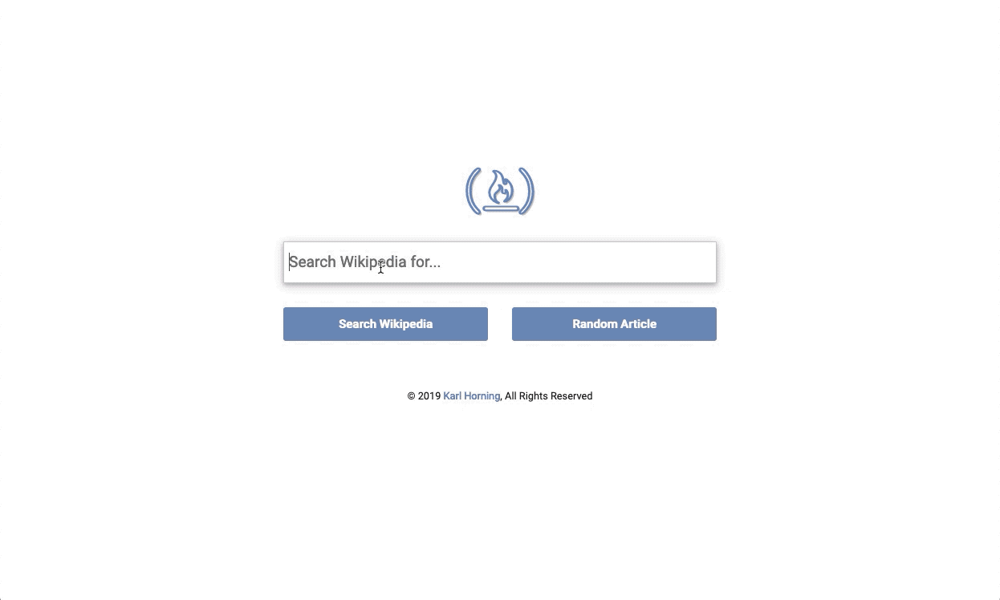

# Wikipedia Viewer

This project is a Wikipedia Viewer developed for the freeCodeCamp challenge 'Build a Wikipedia Viewer'.



## Table of Contents

- [Description](#description)
- [Features](#features)
- [Demo](#demo)
- [Installation](#installation)
- [Usage](#usage)
- [Contributing](#contributing)
- [License](#license)
- [Acknowledgments](#acknowledgments)
- [Author](#author)

## Description

The Wikipedia Viewer is a web application that allows users to search for Wikipedia articles and view the search results. It provides a simple interface for searching, displaying relevant articles, and viewing more details on Wikipedia.

## Features

- Search Wikipedia for articles based on user input.
- Display search results with article titles, snippets, and links.
- Option to view a random Wikipedia article.
- Responsive design for various screen sizes.

## Demo

View the live demo on CodePen: [freeCodeCamp: Build a Wikipedia Viewer](https://codepen.io/karlhorning/pen/NdWjOY).

## Installation

1. Clone the repository:

    ```bash
    git clone https://github.com/Karl-Horning/fcc-build-a-wikipedia-viewer.git
    ```

2. Open the project folder:

    ```bash
    cd fcc-build-a-wikipedia-viewer
    ```

3. Open `index.html` in your preferred web browser.

## Usage

1. Open the application in your web browser.
2. Enter a search query in the provided input field.
3. Click the 'Search Wikipedia' button to retrieve and display relevant articles.
4. Explore the search results, click on article titles to view more details on Wikipedia.
5. Alternatively, click the 'Random Article' button to view a random Wikipedia article.

## Contributing

Contributions are welcome! Please follow these guidelines:

1. Fork the repository.
2. Create a new branch for your feature or bug fix.
3. Make your changes and ensure that the project still works.
4. Create a pull request with a clear description of your changes.

## License

This project is licensed under the [MIT License](LICENSE).

## Acknowledgments

This project wouldn't have been possible without the fantastic contributions of the following libraries:

- [jQuery](https://jquery.com/)
- [FontAwesome](https://fontawesome.com/)
- [Bootstrap](https://getbootstrap.com/)

## Author

Karl Horning: [GitHub](https://github.com/Karl-Horning/) | [LinkedIn](https://www.linkedin.com/in/karl-horning/) | [CodePen](https://codepen.io/karlhorning)